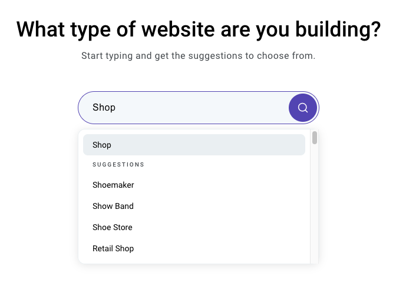

# Autocomplete challenge

Autocomplete is a common component in modern web applications. A simple input field hides a lot of complexity underneath. Let's build one.

## Briefing

Feel free to choose any tech stack you're comfortable with.

## Quest 1 - Get the development environment ready

Imagine this is a long-term project that you're going to work on together with a team. You could just go for a single `index.html` and put all the code there, but be prepared to justify that decision.

## Quest 2 - Build the autocomplete component

The component should look something like this:

