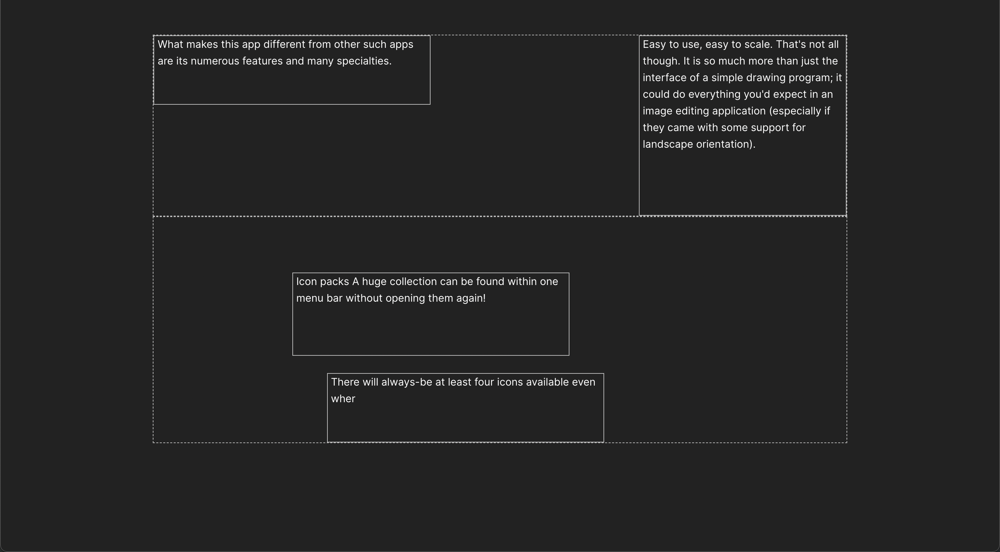

# Mini-builder challenge

Layout system is the foundation of Zyro builder. Let's try to build one!

## Project Setup

```sh
## Install dependencies
npm install

## Start in development mode
npm start
```

## Briefing

The project is using Vue 3.

Feel free to use any additional libraries.

## Quest 1 - Layout system

In `src/assets/siteData.json` you can find the raw data of a site. Build a system that will lay out the blocks and elements in a page. It should look something like this:



## Quest 2 - Add elements

TBD

## Quest 3 - Make them move

TBD
